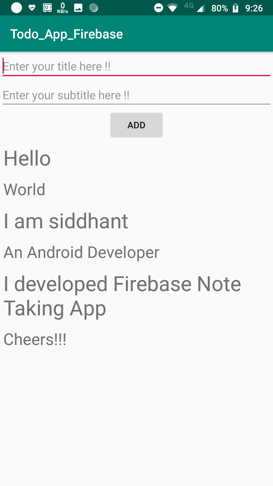
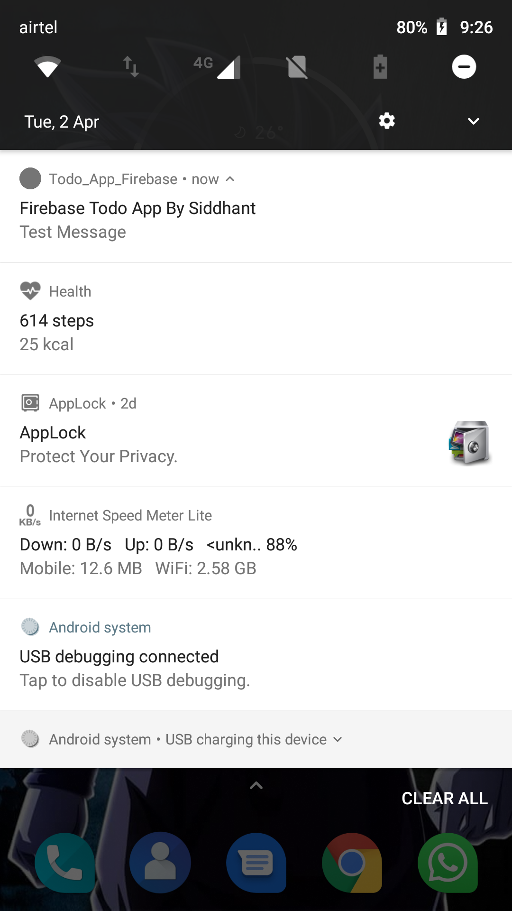
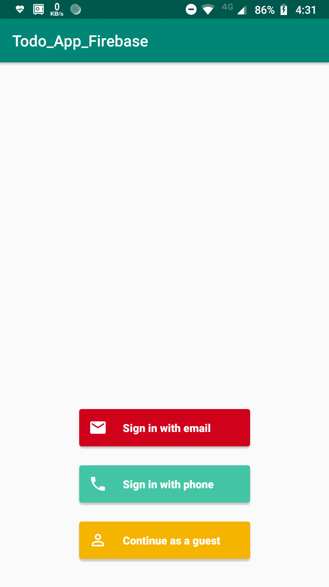

# Todo_App-Firebase-Kotlin
A Todo App made using Firebase and Kotlin

### App Features

* Firebase Real Time database
* Firebase Cloud Messaging
* Firebase Analytics 
* Kotlin
* Implemented Firebase Auth UI Library &nbsp; &nbsp; [Docs](https://github.com/firebase/FirebaseUI-Android/blob/master/auth/README.md)

### App-Screens

 &nbsp;&nbsp;&nbsp;&nbsp;&nbsp;&nbsp;&nbsp;&nbsp;&nbsp;  &nbsp;&nbsp;&nbsp;&nbsp;&nbsp;&nbsp;&nbsp;&nbsp;&nbsp;   

Made by Siddhant in :heart:  with **</>**
